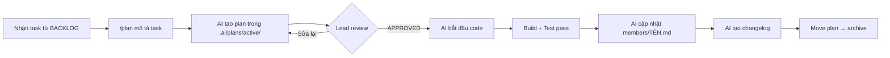

# 📘 Hướng Dẫn Sử Dụng AI Agent Cho Team

> Tài liệu dành cho **tất cả members** trong team Converda.  
> Cập nhật: 2026-02-17

---

## 1. Tổng Quan Hệ Thống

Dự án Converda sử dụng **2 hệ thống** phối hợp với nhau:

```
.agent/   ← "Bộ não" — Agent AI biết làm gì (skills, rules, workflows)
.ai/      ← "Bản đồ" — Team biết ai làm gì, ở đâu, tiến độ ra sao
```

| Thư mục | Mục đích | Ai quản lý |
|---------|----------|------------|
| `.agent/` | Kỹ năng, quy tắc, quy trình của AI | Lead / DevOps |
| `.ai/` | Trạng thái team, phân công, backlog | Lead + Members |

---

## 2. Luồng Làm Việc Hàng Ngày

### 2.1 Khi Bắt Đầu Ngày Làm Việc

Khi mở conversation mới với AI agent, hãy nói:

```
Đọc các file sau theo thứ tự:
1. .ai/INSTRUCTIONS.md
2. .ai/MODULE_OWNERSHIP.md
3. .ai/BACKLOG.md
4. .ai/members/{TÊN_BẠN}.md

Sau đó cho tôi biết task tiếp theo cần làm.
```

> **Tại sao?** AI sẽ hiểu rõ: quy tắc chung → ranh giới module → task được giao → trạng thái hiện tại.

### 2.2 Khi Nhận Task Mới



**Các bước cụ thể:**

| Bước | Bạn nói | AI làm |
|------|---------|--------|
| 1. Lập kế hoạch | `/plan thêm SSO Google OAuth` | Tạo `.ai/plans/active/PLAN-sso-google.md` |
| 2. Chờ duyệt | Review plan, góp ý | AI sửa plan theo feedback |
| 3. Triển khai | `APPROVED` | AI bắt đầu viết code |
| 4. Kiểm tra | AI tự chạy | `go build ./...` + `go test -race ./...` |
| 5. Cập nhật | AI tự làm | Update `.ai/members/TÊN.md` + tạo changelog |

### 2.3 Khi Kết Thúc Task

AI sẽ tự động:
1. ✅ Cập nhật trạng thái trong `.ai/members/{TÊN}.md`
2. ✅ Tạo file changelog: `.ai/changelog/{ngày}-{tên-task}.md`
3. ✅ Move plan từ `active/` sang `archive/`

Bạn chỉ cần báo Lead để update `BACKLOG.md`.

---

## 3. Cấu Trúc `.ai/` — Chi Tiết Từng File

### 📄 `INSTRUCTIONS.md` — Quy tắc chung
- **Ai edit:** Chỉ Lead
- **Ai đọc:** Tất cả AI agents
- **Nội dung:** Module boundary protocol, review levels, coding standards, commit convention
- **Khi nào đọc:** Đầu mỗi conversation mới

### 📄 `MODULE_OWNERSHIP.md` — Ai sở hữu module nào
- **Ai edit:** Chỉ Lead
- **Ai đọc:** Tất cả AI agents
- **Nội dung:** Bảng mapping `Module → Owner → Backup`
- **Quan trọng:** AI agent sẽ **TỪ CHỐI** sửa file trong module không thuộc quyền sở hữu

### 📄 `BACKLOG.md` — Danh sách việc cần làm
- **Ai edit:** Chỉ Lead
- **Ai đọc:** Tất cả AI agents
- **Nội dung:** Active sprint + backlog + completed tasks
- **Members KHÔNG edit file này** — thay vào đó update trạng thái trong file riêng

### 📁 `members/{TÊN}.md` — Trạng thái cá nhân
- **Ai edit:** Chỉ AI agent của member đó
- **Ai đọc:** Tất cả (để biết đồng đội đang làm gì)
- **Nội dung:** Current focus, recent completions, modules owned, pending reviews

### 📁 `plans/active/` — Plan đang triển khai
- **Chứa:** Plan file cho task đang làm
- **Quy tắc:** Khi task xong → move sang `plans/archive/`

### 📁 `plans/archive/` — Plan đã hoàn thành
- **Chứa:** 33+ plan files từ các feature đã done
- **Mục đích:** Reference khi cần xem lại thiết kế cũ

### 📁 `changelog/` — Nhật ký thay đổi
- **Ai tạo:** AI agent sau khi hoàn thành feature
- **Ai đọc:** Tất cả members
- **Mục đích:** Khi pull code mới, đọc changelog để biết có gì thay đổi

---

## 4. Cấu Trúc `.agent/` — Hệ Thống Kỹ Năng AI

### 📁 `agents/` — 23 Chuyên Gia AI

AI sẽ **tự động chọn** chuyên gia phù hợp dựa trên yêu cầu của bạn:

| Yêu cầu của bạn | Agent được kích hoạt |
|------------------|---------------------|
| Viết API mới | `backend-specialist` |
| Thiết kế database | `database-architect` |
| Fix bug | `debugger` |
| Review bảo mật | `security-auditor` |
| Lập kế hoạch | `project-planner` |
| Task phức tạp nhiều bước | `orchestrator` |

### 📁 `workflows/` — 22 Lệnh Slash

Gõ `/command` để kích hoạt quy trình:

| Lệnh | Công dụng | Ví dụ |
|-------|-----------|-------|
| `/plan` | Lập kế hoạch | `/plan thêm WebSocket cho messaging` |
| `/create` | Tạo feature mới | `/create repository cho user preferences` |
| `/debug` | Gỡ lỗi có hệ thống | `/debug API trả về 500 khi gọi /workflows` |
| `/test` | Tạo + chạy test | `/test cho DigestHandler` |
| `/brainstorm` | Phân tích ý tưởng | `/brainstorm cách thiết kế SSO` |
| `/audit` | Kiểm tra chất lượng code | `/audit module messaging` |
| `/status` | Xem trạng thái hiện tại | `/status` |
| `/deploy` | Quy trình triển khai | `/deploy staging` |

### 📁 `rules/` — 12 Quy Tắc Toàn Cục

Các quy tắc AI tự động tuân thủ:

| Rule | Nội dung |
|------|----------|
| `backend.md` | Quy tắc viết backend Go |
| `security.md` | Quy tắc bảo mật |
| `debug.md` | Quy trình debug |
| `error-logging.md` | Chuẩn logging |
| `docs-update.md` | Quy tắc viết docs |

### 📁 `skills/` — Kho Kỹ Năng Chuyên Sâu

AI sẽ tải skill phù hợp khi cần. Ví dụ:
- Yêu cầu tối ưu SQL → load `database-design` skill
- Yêu cầu CI/CD → load `deployment-engineer` skill

---

## 5. Quy Tắc Vàng — Tránh Conflict

### ❌ KHÔNG được làm

| Hành động | Lý do |
|-----------|-------|
| Sửa `BACKLOG.md` | Chỉ Lead edit |
| Sửa `MODULE_OWNERSHIP.md` | Chỉ Lead edit |
| Sửa `members/` file của người khác | Mỗi người chỉ edit file của mình |
| Sửa code trong module của người khác | Check `MODULE_OWNERSHIP.md` trước |
| Viết code mà không có plan | Luôn `/plan` trước |

### ✅ NÊN làm

| Hành động | Cách làm |
|-----------|----------|
| Biết đồng đội đang làm gì | Đọc `members/` của họ |
| Hiểu code mới được merge | Đọc `changelog/` |
| Bắt đầu task mới | `/plan` → `APPROVED` → code |
| Sửa cross-module | Flag trong plan: "Requires {OWNER} Approval" |

---

## 6. Onboarding Member Mới

### Lead thực hiện:
1. Copy `.ai/members/TEMPLATE.md` → `.ai/members/{TÊN_MỚI}.md`
2. Update `MODULE_OWNERSHIP.md` — gán module
3. Update `BACKLOG.md` — gán task

### Member mới thực hiện:
1. Đọc file này (`GUIDE.vi.md`)
2. Gõ vào AI chat:
```
Đọc lần lượt:
1. .ai/INSTRUCTIONS.md
2. .ai/MODULE_OWNERSHIP.md
3. .ai/BACKLOG.md
4. .ai/members/{TÊN_TÔI}.md
5. .agent/ARCHITECTURE.vi.md

Xác nhận bạn đã hiểu vai trò và module của tôi.
```

---

## 7. Cách Kết Hợp `.ai/` và `.agent/` Hiệu Quả

```
┌─────────────────────────────────────────────────────────────┐
│                                                             │
│  .ai/INSTRUCTIONS.md     →  AI biết QUY TẮC team           │
│  .ai/MODULE_OWNERSHIP.md →  AI biết RANH GIỚI module        │
│  .ai/BACKLOG.md          →  AI biết TASK cần làm            │
│  .ai/members/{TÊN}.md   →  AI biết TRẠNG THÁI hiện tại     │
│                                                             │
│  .agent/agents/          →  AI biết CÁCH LÀM (vai trò)     │
│  .agent/workflows/       →  AI biết QUY TRÌNH (plan/debug)  │
│  .agent/rules/           →  AI biết CHUẨN CODE (best practice)│
│  .agent/skills/          →  AI biết KỸ NĂNG chuyên sâu      │
│                                                             │
│  ═══════════════════════════════════════════════════════     │
│  .ai/ = WHAT (Làm gì)    +    .agent/ = HOW (Làm thế nào)  │
│                                                             │
└─────────────────────────────────────────────────────────────┘
```

---

## 8. FAQ

**Q: Tôi có thể dùng AI agent nào?**  
A: Bất kỳ — Claude, Gemini, Cursor, Antigravity đều tương thích. Chỉ cần đảm bảo AI đọc `.ai/INSTRUCTIONS.md` khi bắt đầu.

**Q: AI agent của tôi có thể đọc file state của member khác không?**  
A: Đọc thì **được** (để biết context), nhưng **KHÔNG ĐƯỢC EDIT**.

**Q: Nếu task của tôi cần sửa module của người khác thì sao?**  
A: Ghi rõ trong plan → flag "Cross-Module: requires {OWNER} review" → Owner phải approve.

**Q: Lead update BACKLOG khi nào?**  
A: Khi bắt đầu sprint mới, khi member báo task done, hoặc khi cần điều chỉnh ưu tiên.

**Q: Có cần commit file `.ai/` vào git không?**  
A: **Có** — đây là single source of truth cho team. Tất cả members cần pull file mới nhất.

---

> 💡 **Nhớ:** `.ai/` = Bản đồ chiến trường | `.agent/` = Vũ khí chiến đấu  
> Dùng cả hai để AI agent phát huy tối đa hiệu quả! 🚀
