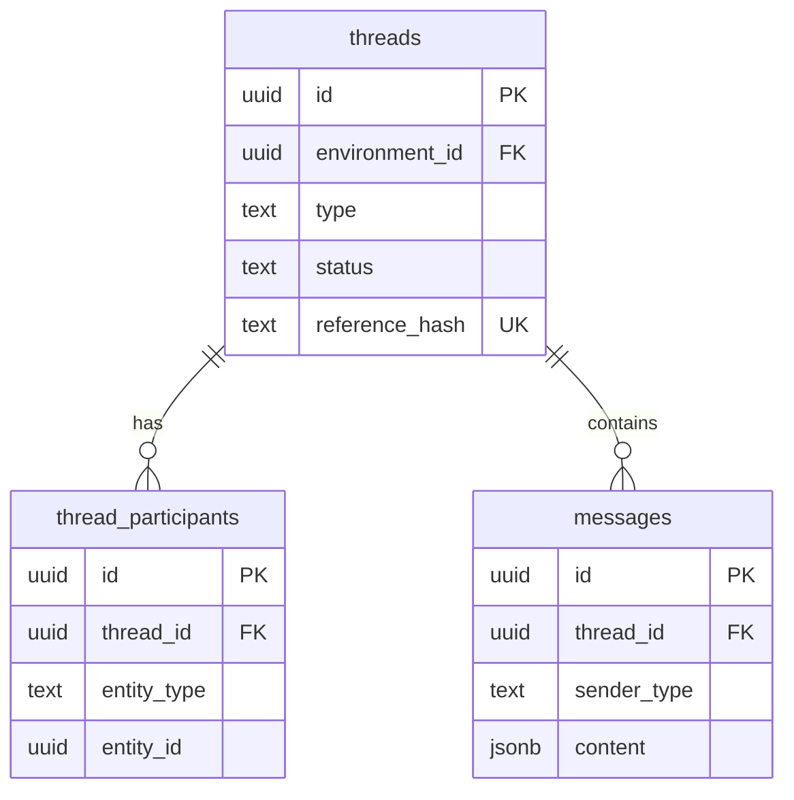

# Implementation Plan - Messaging Database Refactor

## 1. Context Analysis (Phase 1)
- **Problem**: Migration database (`sql/schema`) chưa khớp với model polymorphic (Subscriber Chat) và schema thiết kế trong `schema.sql`.
- **Target**: Đảm bảo database hỗ trợ bảng `thread_participants`, rename bảng cũ `conversation_pools` thành `threads`, và bổ sung các cơ chế bảo mật (RLS).

## 2. Requirement Definition (Phase 2)

### User Story
`As a System Agent, I want to store messaging data in a polymorphic and secure structure, so that mixed conversations (User & Subscriber) work correctly across environments.`

### Acceptance Criteria (AC)
- **AC1**: Bảng `threads` tồn tại (rename từ `conversation_pools`).
- **AC2**: Bảng `thread_participants` tồn tại với cột `entity_type` (user/subscriber).
- **AC3**: Cột `pool_id` trong tất cả các bảng liên quan được đổi tên thành `thread_id`.
- **AC4**: Cột `reference_hash` (Unique) được thêm vào `threads` để xử lý Race Condition.
- **AC5**: RLS được kích hoạt cho các bảng messaging mới.

## 3. Technical Blueprint (Phase 3)

### Migration Strategy
Sử dụng **Goose migration (SQL)** để thay đổi schema mà không gây mất dữ liệu hiện có.

### Database Schema (Refactor)

## 4. Task Orchestration (Phase 4)

| Task ID | Agent Assignment | Skills | Target File | Task Description |
| :--- | :--- | :--- | :--- | :--- |
| T1 | **Database Architect** | `database-migration` | `sql/schema/00020_messaging_polymorphic_refactor.sql` | Tạo migration rename bảng/cột và thêm bảng mới. |
| T2 | **Database Architect** | `database-migration` | `sql/schema/00020_...` | Thêm logic di chuyển dữ liệu (Data Migration) từ Pool sang Thread/Participants. |
| T3 | **Security Auditor** | `security-armor` | `sql/schema/00020_...` | Áp dụng RLS policies lên `threads` và `thread_participants`. |
| T4 | **Backend Specialist** | `full-stack-scaffold` | `internal/messaging/...` | Chạy migrate và verify repo logic (Go code đã sẵn sàng từ task trước). |

---

## Verification Plan

### Automated Tests (Verification Task)
1. **Migration Test**: Chạy `goose up` để xác nhận SQL không lỗi.
2. **Schema Audit**: Truy vấn `information_schema.tables` để verify bảng mới.
3. **Repository Tests**: Chạy `go test -v ./internal/messaging/infrastructure/persistence/repository/...` để verify Repository Go hoạt động đúng với schema mới.

### Manual Verification
- Dùng `psql` kiểm tra: `\d threads` và `\d thread_participants`.
- Kiểm tra các index unique trên `reference_hash`.
- Kiểm tra RLS: `SELECT * FROM threads` với role khác nhau.
