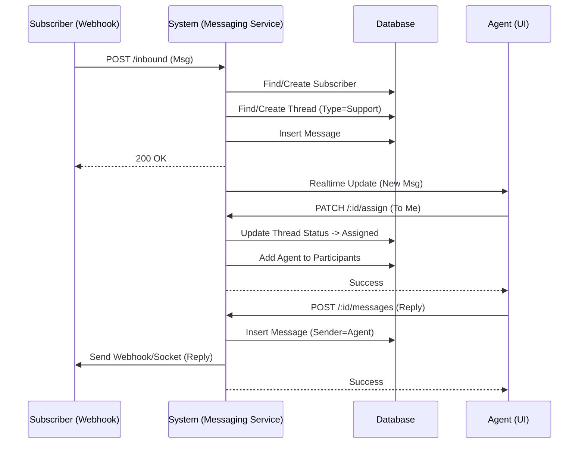
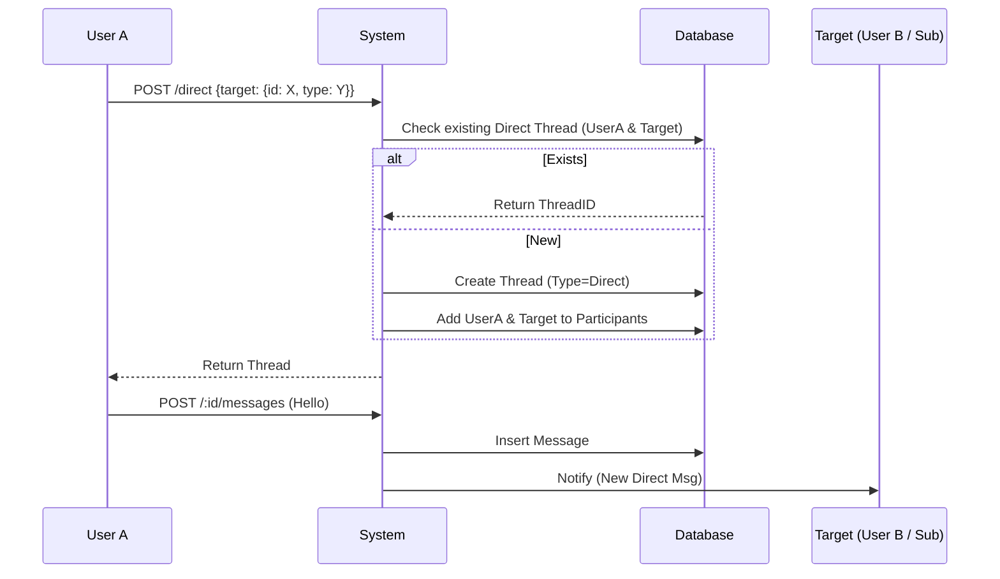
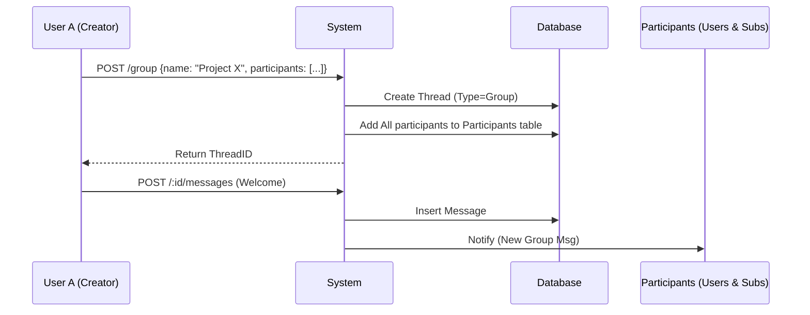

# Tài liệu Messaging Module

Tài liệu này mô tả chi tiết về cấu trúc dữ liệu, API và luồng hoạt động của Messaging Module trong hệ thống Converda.

## 1. Cơ sở dữ liệu (Database Schema)

Module Messaging sử dụng các bảng sau để lưu trữ dữ liệu hội thoại, tin nhắn và trạng thái tham gia.

### 1.1 `conversation_pools` (Threads)
Bảng chính lưu trữ các cuộc hội thoại (threads). Trong mã nguồn (Codebase), thực thể này thường được gọi là `Thread`.

| Cột | Kiểu dữ liệu | Mô tả |
| :--- | :--- | :--- |
| `id` | UUID | Khóa chính, định danh cuộc hội thoại. |
| `environment_id` | UUID | Định danh môi trường (Environment) chứa hội thoại. |
| `subscriber_id` | UUID | (Legacy/Support) ID của người đăng ký (khách hàng) nếu là hội thoại CSKH. Có thể NULL cho hội thoại nội bộ. |
| `status` | TEXT | Trạng thái hội thoại: `unassigned`, `assigned`, `resolved`. |
| `type` | TEXT | Loại hội thoại: `support` (CSKH), `direct` (1-1), `group` (Nhóm). |
| `metadata` | JSONB | Dữ liệu bổ sung (ví dụ: tên nhóm chat). |
| `created_at` | TIMESTAMP | Thời gian tạo. |
| `updated_at` | TIMESTAMP | Thời gian cập nhật gần nhất. |

### 1.2 `messages`
Lưu trữ nội dung tin nhắn của tất cả các cuộc hội thoại.

| Cột | Kiểu dữ liệu | Mô tả |
| :--- | :--- | :--- |
| `id` | UUID | Khóa chính. |
| `thread_id` (pool_id) | UUID | ID của cuộc hội thoại chứa tin nhắn này. |
| `tenant_id` | UUID | ID của Tenant sở hữu. |
| `sender_type` | TEXT | Loại người gửi: `user` (Agent/Member), `contact` (Subscriber), `system`. |
| `sender_id` | UUID | ID của người gửi. |
| `content` | JSONB | Nội dung tin nhắn (cấu trúc JSON linh hoạt, hỗ trợ text, attachments). |
| `parent_id` | UUID | ID tin nhắn cha (nếu là reply). |
| `created_at` | TIMESTAMP | Thời gian gửi. |

### 1.3 `message_closure`
Bảng hỗ trợ truy vấn cây tin nhắn (Closure Table Pattern) thay thế cho Nested Set model cũ, giúp truy vấn lịch sử và quan hệ cha-con hiệu quả hơn.

| Cột | Kiểu dữ liệu | Mô tả |
| :--- | :--- | :--- |
| `ancestor_id` | UUID | ID tin nhắn tổ tiên. |
| `descendant_id` | UUID | ID tin nhắn con cháu. |
| `depth` | INT | Khoảng cách thế hệ giữa 2 tin nhắn (0 = chính nó). |

### 1.4 `thread_participants`
Lưu trữ danh sách thành viên tham gia vào một cuộc hội thoại. Hệ thống hỗ trợ cả người dùng nội bộ (`user`) và khách hàng bên ngoài (`subscriber`).

| Cột | Kiểu dữ liệu | Mô tả |
| :--- | :--- | :--- |
| `id` | UUID | Khóa chính. |
| `thread_id` | UUID | ID cuộc hội thoại. |
| `entity_type` | TEXT | Loại thực thể: `user`, `subscriber`. |
| `entity_id` | UUID | ID của thành viên tham gia. |
| `last_read_at` | TIMESTAMP | Thời điểm cuối cùng thành viên đọc tin nhắn (dùng cho tính năng Seen/Unread). |

### 1.5 `subscribers` (Contacts)
Lưu trữ thông tin khách hàng bên ngoài (người dùng cuối tương tác qua Webhook/Widget).

| Cột | Kiểu dữ liệu | Mô tả |
| :--- | :--- | :--- |
| `id` | UUID | Khóa chính. |
| `subscriber_key` | TEXT | Khóa định danh duy nhất từ kênh (ví dụ: external_user_id). |
| `email` | TEXT | Email khách hàng (nếu có). |
| `data` | JSONB | Thông tin bổ sung (profile, attributes). |

### 1.6 `assignment_logs`
Lưu lịch sử phân công và hiệu suất xử lý hội thoại (dùng cho Analytics).

| Cột | Kiểu dữ liệu | Mô tả |
| :--- | :--- | :--- |
| `pool_id` | UUID | ID hội thoại. |
| `assigned_to` | UUID | ID nhân viên được phân công. |
| `assigned_at` | TIMESTAMP | Thời gian phân công. |
| `resolved_at` | TIMESTAMP | Thời gian giải quyết (Resolved). |
| `response_time` | INT | Thời gian xử lý (giây). |

---

## 2. API Documentation

### 2.1 Public / Webhook APIs (Dành cho Subscriber/System)

#### `POST /conversations/inbound`
Tiếp nhận tin nhắn từ bên ngoài (Webhook, SDK widget).
- **Body**: `{ "subscriber_key": "...", "content": {...} }`
- **Chức năng**:
  - Tìm hoặc tạo Subscriber mới.
  - Tìm hội thoại `support` đang mở hoặc tạo mới.
  - Lưu tin nhắn vào hệ thống.

### 2.2 User / Agent APIs (Dành cho Member nội bộ)

#### `GET /conversations`
Lấy danh sách hội thoại.
- **Query Params**: `status` (unassigned, assigned, resolved), `assigned_to` (me, all).
- **Chức năng**: Hiển thị Inbox cho Agent.

#### `GET /conversations/:id`
Lấy chi tiết nội dung cuộc hội thoại.

#### `POST /conversations/:id/messages`
Gửi tin nhắn trả lời (Reply).
- **Body**: `{ "content": {...} }`
- **Chức năng**: Gửi tin nhắn với tư cách Agent/User vào hội thoại.

#### `POST /conversations/:id/notes`
Thêm ghi chú nội bộ (Internal Note).
- **Body**: `{ "content": {...} }`
- **Chức năng**: Tin nhắn chỉ hiển thị cho nhân viên nội bộ (Subscriber không thấy).

#### `POST /conversations/:id/read`
Đánh dấu đã đọc.
- **Chức năng**: Cập nhật `last_read_at` cho người dùng hiện tại trong `thread_participants`.

#### `POST /conversations/direct`
Tạo hoặc lấy hội thoại chat 1-1 (Direct Chat).
- **Body**: 
  ```json
  {
    "target": {
      "id": "UUID",
      "type": "user" | "subscriber"
    }
  }
  ```
- **Chức năng**: Kiểm tra xem đã có hội thoại 1-1 giữa người gọi và đối tượng `target` chưa, nếu chưa thì tạo mới. Hỗ trợ chat giữa 2 Users hoặc User-Subscriber.

#### `POST /conversations/group`
Tạo hội thoại nhóm (Group Chat).
- **Body**: 
  ```json
  {
    "name": "Team A",
    "participants": [
      { "id": "UUID", "type": "user" },
      { "id": "UUID", "type": "subscriber" }
    ]
  }
  ```
- **Chức năng**: Tạo hội thoại mới loại `group` và thêm danh sách thành viên tham gia (không phân biệt User hay Subscriber).

#### `PATCH /conversations/group/:id`
Cập nhật thông tin nhóm (ví dụ: đổi tên).

#### `POST /conversations/group/:id/participants`
Thêm thành viên vào nhóm.
- **Body**: 
  ```json
  {
    "participants": [
      { "id": "UUID", "type": "user" },
      { "id": "UUID", "type": "subscriber" }
    ]
  }
  ```

#### `DELETE /conversations/group/:id/participants/:memberId`
Xóa thành viên khỏi nhóm.

#### `PATCH /conversations/:id/assign`
Phân công hội thoại cho nhân viên.

#### `POST /conversations/:id/resolve`
Đánh dấu hội thoại là đã giải quyết (Resolved).

---

## 3. Feature Flows (Luồng tính năng)

### 3.1 Luồng Hỗ trợ Khách hàng (Support Chat Flow)
Luồng tương tác giữa Khách hàng (Subscriber) và Nhân viên (Agent).



### 3.2 Luồng Chat Nội bộ và Chat với Khách hàng (Direct & Group Flow)
Hệ thống cho phép chat 1-1 hoặc theo nhóm linh hoạt giữa các thực thể.

#### Direct Chat (Polymorphic)


#### Group Chat (Mixed Participants)

