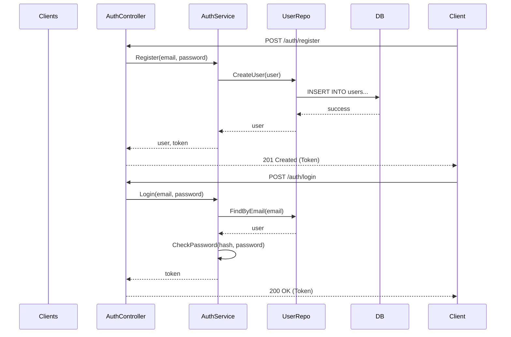
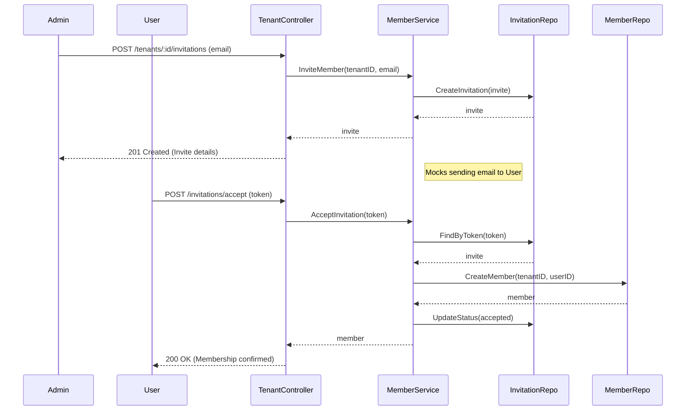
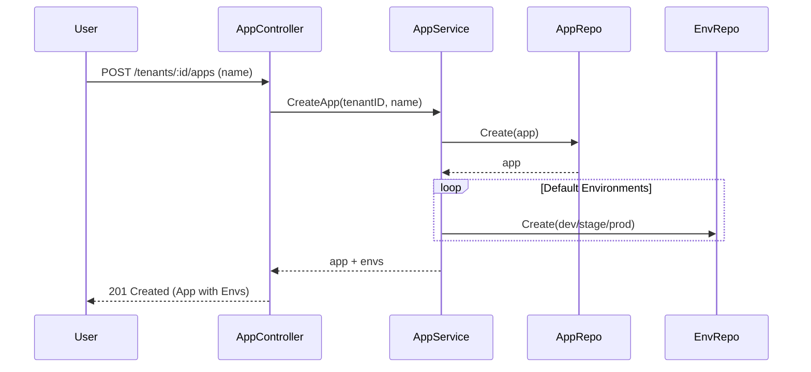
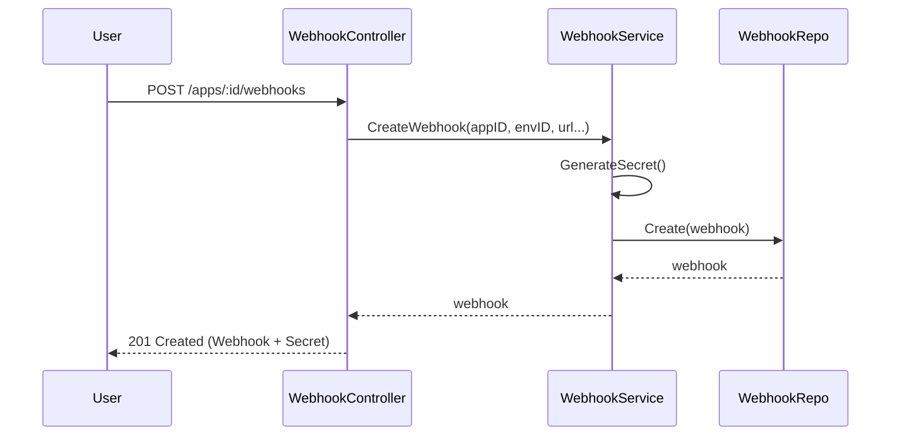

# Module Flows Documentation

This document describes the key flows within the **IAM** and **Apps** modules, including sequence diagrams for visual understanding.

## IAM Module

### 1. Authentication Flow
**Goal**: User registers, logs in, and obtains a JWT token.

### 2. Tenant & Member Invitation Flow
**Goal**: Admin invites a user to a tenant. User accepts.

## Apps Module

### 1. App Creation Flow
**Goal**: Create an App and auto-provision environments.

### 2. Webhook Management
**Goal**: Create a webhook for an environment.

