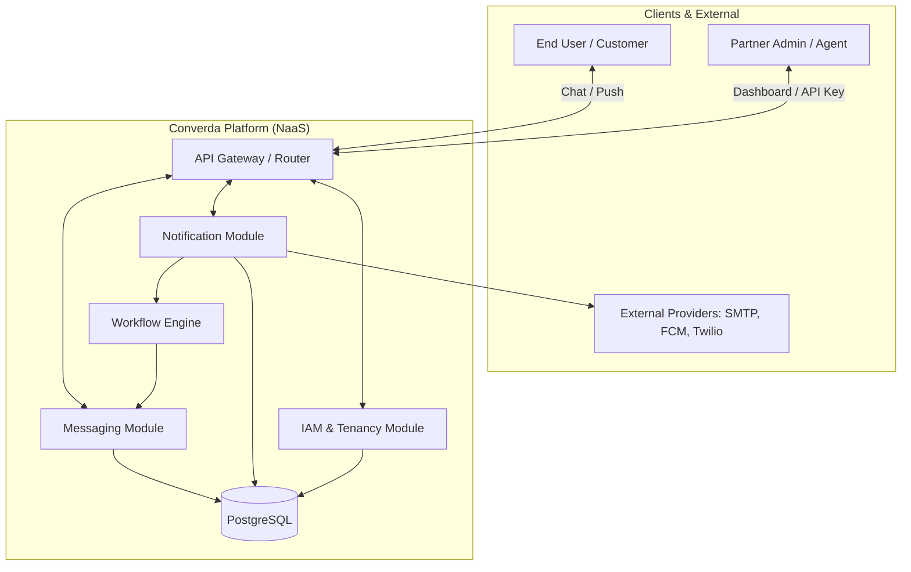
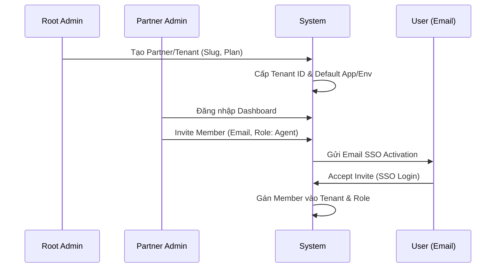
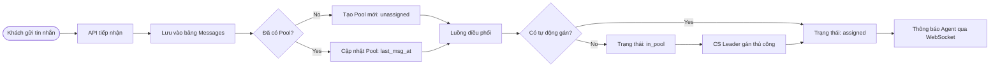
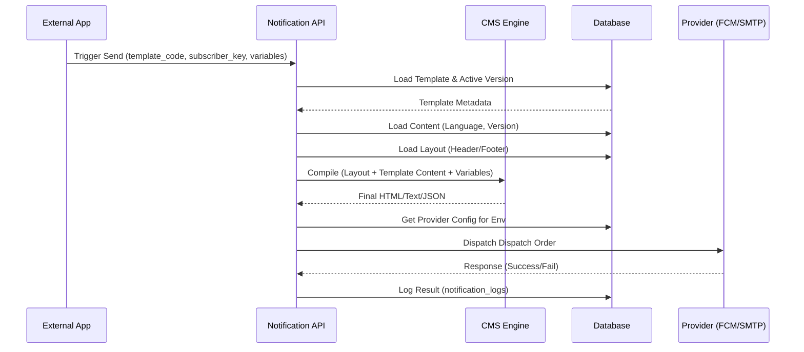
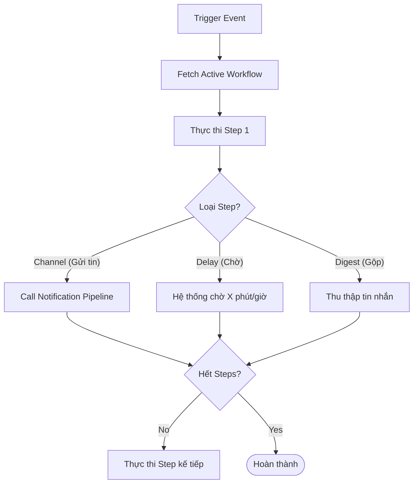

# Dự án Converda - Quy trình hệ thống (System Flows)

Tài liệu này mô tả các luồng hoạt động chính của hệ thống bằng sơ đồ Mermaid.

## 1. Tổng quan kiến trúc (System Architecture Overview)

Hệ thống được thiết kế theo mô hình Multi-tenant (Đa người thuê), phân tách dữ liệu theo Tenant và Môi trường.

---

## 2. Luồng tính năng chi tiết (Feature Flows)

### A. Quản lý định danh và thành viên (IAM & Onboarding)
Quy trình từ lúc tạo Tenant đến khi mời nhân viên CS.

---

### B. Luồng nhắn tin và điều phối (Messaging & Helpdesk)
Cách tin nhắn từ khách hàng được đưa vào Pool và giao cho Agent.

---

### C. Pipeline thông báo (Notification Pipeline - CMS Style)
Quy trình xử lý một thông báo từ Trigger đến lúc gửi đi, tích hợp layout và đa ngôn ngữ.

---

### D. Quy trình thực thi Workflow (Workflow Engine)
Luồng tự động hóa dựa trên các bước (Steps).

